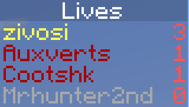

# Configuration

Most, if not all commands require operator permissions to function. 

Almost all configuration options can be run in-game, without needing to restart the server.

Some commands require creative mode, which you can obtain after [allowing gamemode switching](#gamemodes)
## Lives
### Setting Lives
Set a player's lives to a specific value.

Command: `/scoreboard players set (player) headless_Lives (number)`
### Displaying Lives
#### Below a players name:
`/scoreboard objectives setdisplay below_name headless_Lives`

(placeholder for image)
#### In the player list:
`/scoreboard objectives setdisplay list headless_Lives`

#### In the sidebar:
`/scoreboard objectives setdisplay sidebar headless_Lives`

### Maximum Lives
Changes the maximum number of lives a player can obtain.

Command: `/scoreboard players set MaxLives headless_Settings (number)`  
Default: 5
### Starting Lives
Changes the amount of lives each player will get after joining for the first time.

`/scoreboard players set Lives headless_Settings (number)`  
Default: 3
### Resetting Lives
Resets everyone's lives to the [default](#starting-lives).

Command: `/trigger ResetHeadless`

*Note*: This command requires creative mode.  
*Note*: Players will have their lives reset the next time they join the game.
## Gamemodes
By default, this datapack will force all players into survival or spectator.
### Bypass survival mode
Normally, players with lives remaining will be forced into survival mode at all times. Enabling this bypass allows players to use the creative, spectator, and adventure gamemodes while having lives.

Enable: `/scoreboard players set (player) headless_AllowNonSurvivalMode 1`  
Disable: `/scoreboard players set (player) headless_AllowNonSurvivalMode 0`  

*Note*: If a player with this bypass enabled gets revived, then they will not automatically switch back into survival mode.
### Bypass spectator mode

Normally, players with no lives remaining will be forced into spectator mode at all times. Enabling this bypass allows players to use the creative, survival, and adventure gamemodes without having lives.

Enable: `/scoreboard players set (player) headless_AllowNonSpectatorMode 1`  
Disable: `/scoreboard players set (player) headless_AllowNonSpectatorMode 0`  

*Note*: If a player with this bypass enabled gets eliminated, then they will not automatically switch into spectator mode.

## Head Anti-Dupe

Normally, this datapack runs a quick check to defend against people duping heads. In this check, every head in an online player's inventory is checked against every currently online player with more than one life. Enabling this bypass will allow you to obtain the head of a living person.

Enable: `/scoreboard players set (player) headless_AllowDupedHeads 1`  
Disable: `/scoreboard players set (player) headless_AllowDupedHeads 0`

*Note*: This disables removing anyone's heads from the specified players inventory, not the other way around.

## Crafting recipe